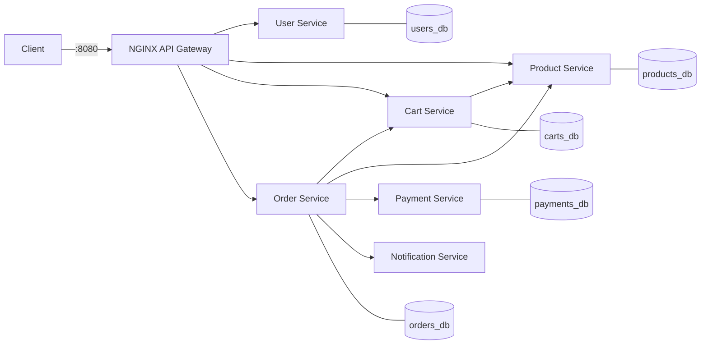

# Scalable E-Commerce Platform (Microservices + Docker)

An online store split into independent Python (FastAPI) microservices, each with its own
database, running behind an NGINX API gateway and started with a single `docker compose up`.

**Project page:** <PASTE YOUR PROJECT PAGE URL HERE>

## Architecture



| Service | Responsibility | Exposed via gateway |
|---|---|---|
| user-service | Register, login (JWT), profile | `/api/users/*` |
| product-service | Catalog, categories, stock, stock reservation | `/api/products/*` (internal endpoints blocked) |
| cart-service | Per-user cart, price snapshot, stock check | `/api/cart/*` |
| order-service | Checkout orchestration, order history, status updates | `/api/orders/*` |
| payment-service | Mock payment processor | internal only |
| notification-service | Order/payment notifications (logged) | internal only |
| gateway (NGINX) | Single entry point, routing | `localhost:8080` |

Design notes:
- **Database per service**: one Postgres container hosting five separate databases.
- **Service discovery**: Docker Compose DNS, so services call each other by name
  (`http://product-service:8000`). Only the gateway publishes a port.
- **Auth**: JWT issued by the user service, validated by each service using a shared secret.
  The user whose email equals `ADMIN_EMAIL` gets the `admin` role.
- **Checkout** (order service): read cart -> reserve stock -> create order -> pay ->
  mark `PAID` and clear cart, or mark `PAYMENT_FAILED` and release the stock.
- **Mocked**: payments (cards ending in `0000` are declined) and notifications (logged only).
  Swap in Stripe test mode / SendGrid / Twilio inside those two services.

## Prerequisites
Docker and Docker Compose v2. (Python is only needed if you want to run the tests locally.)

## Run it
```bash
git clone <your-repo-url> && cd ecommerce-platform
cp .env.example .env        # optional but recommended: edit the secrets
docker compose up --build
```
Check it: `curl http://localhost:8080/health` -> `gateway ok`.
Interactive API docs are not exposed through the gateway; to view a service's Swagger UI,
temporarily add a `ports:` mapping (e.g. `"9001:8000"`) to that service and open `/docs`.

## Try the main flow
```bash
BASE=http://localhost:8080

# 1. Register an admin (must match ADMIN_EMAIL) and a customer
curl -X POST $BASE/api/users/register -H 'Content-Type: application/json' \
  -d '{"email":"admin@example.com","password":"secret123","full_name":"Admin"}'
curl -X POST $BASE/api/users/register -H 'Content-Type: application/json' \
  -d '{"email":"me@example.com","password":"secret123","full_name":"Me"}'

# 2. Log in (copy the access_token from each response)
ADMIN=$(curl -s -X POST $BASE/api/users/login -H 'Content-Type: application/json' \
  -d '{"email":"admin@example.com","password":"secret123"}' | python3 -c 'import sys,json;print(json.load(sys.stdin)["access_token"])')
USER=$(curl -s -X POST $BASE/api/users/login -H 'Content-Type: application/json' \
  -d '{"email":"me@example.com","password":"secret123"}' | python3 -c 'import sys,json;print(json.load(sys.stdin)["access_token"])')

# 3. Admin creates a product
curl -X POST $BASE/api/products -H "Authorization: Bearer $ADMIN" -H 'Content-Type: application/json' \
  -d '{"name":"Mechanical Keyboard","category":"electronics","price":79.99,"stock":25}'

# 4. Customer browses, adds to cart, checks out
curl "$BASE/api/products?category=electronics"
curl -X POST $BASE/api/cart/items -H "Authorization: Bearer $USER" -H 'Content-Type: application/json' \
  -d '{"product_id":1,"quantity":2}'
curl -X POST $BASE/api/orders -H "Authorization: Bearer $USER" -H 'Content-Type: application/json' -d '{}'

# 5. Order history, and admin marks it shipped
curl $BASE/api/orders -H "Authorization: Bearer $USER"
curl -X PUT $BASE/api/orders/1/status -H "Authorization: Bearer $ADMIN" \
  -H 'Content-Type: application/json' -d '{"status":"shipped"}'
```
Use card `4000000000000000` in the order body (`{"card_number": "..."}`) to see a declined payment.
Watch notifications with `docker compose logs -f notification-service`.

## API summary
| Method & path | Auth | Description |
|---|---|---|
| POST `/api/users/register`, `/api/users/login` | - | Sign up / get JWT |
| GET, PUT `/api/users/me` | user | View / update profile |
| GET `/api/products` (`?category=`, `?q=`), GET `/api/products/{id}` | - | Browse |
| POST, PUT, DELETE `/api/products[/{id}]` | admin | Manage catalog |
| GET, DELETE `/api/cart` | user | View / clear cart |
| POST `/api/cart/items`, PUT/DELETE `/api/cart/items/{product_id}` | user | Edit cart |
| POST `/api/orders` | user | Checkout (pays with mock gateway) |
| GET `/api/orders`, GET `/api/orders/{id}` | user | History / detail |
| PUT `/api/orders/{id}/status` | admin | SHIPPED, DELIVERED, CANCELLED |

## Tests and CI
End-to-end tests run against the live stack through the gateway:
```bash
docker compose up -d --build
pip install -r tests/requirements.txt
pytest -v tests
```
GitHub Actions (`.github/workflows/ci.yml`) builds every image, starts the stack, waits for
the gateway, and runs the same tests on each push and pull request.

## Project layout
```
docker-compose.yml   gateway/nginx.conf   db/init-databases.sql
services/{user,product,cart,order,payment,notification}-service/  (main.py, Dockerfile, ...)
tests/test_flow.py   .github/workflows/ci.yml
```

## Future improvements
Prometheus + Grafana monitoring, ELK/Loki centralized logging, RabbitMQ events instead of
synchronous calls, Stripe test mode, refresh tokens, database migrations (Alembic),
Kubernetes manifests, rate limiting at the gateway.
